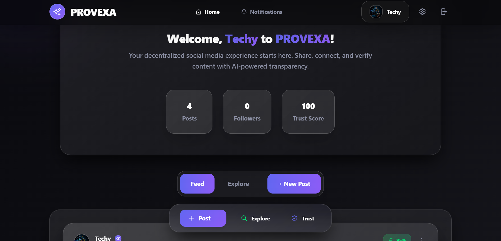

# PROVEXA: Decentralized Social Media with On-Chain Trust & AI Moderation



> **A next-generation decentralized social platform: verifiable identity, on-chain transparency, and AI-powered trust.**

[](https://solana.com/) [](https://fastapi.tiangolo.com/) [](https://react.dev/)

---

## Overview
**PROVEXA** is a decentralized social media platform that:
- Uses **Web3 wallet-based identity** (Phantom/Solana)
- Logs every post, edit, and delete **on-chain** for public auditability
- Moderates all content with **AI (LLM) trust scoring**
- Delivers a modern, privacy-first, censorship-resistant social experience

## ⚙️ Dev Environment Notes
This app is deployed on Solana Devnet.  
- Use Phantom wallet connected to Devnet.  
- Request free SOL via [Solana Devnet Faucet](https://solfaucet.com/). 

## Features
- **Web3 Login:** Secure, wallet-based authentication
- **On-Chain Logging:** All actions are recorded on Solana for transparency
- **AI Moderation:** Every post is evaluated for trust, safety, and authenticity
- **Explore Feed:** View all community posts with trust indicators
- **Comment & Like:** Social engagement with trust metrics
- **Trust Snapshot:** One-tap view of post origin, hash, and trustworthiness
- **Profile Management:** Custom display name, avatar, and bio

## Tech Stack
- **Frontend:** Vite, React, TypeScript, TailwindCSS
- **Backend:** FastAPI (Python), Firebase Firestore, OpenRouter API
- **Blockchain:** Solana (Anchor Framework, Rust smart contract)
- **AI Moderation:** OpenRouter LLM (default: `mistralai/mistral-7b-instruct`)

## Architecture
```
[User]
  ↓ (Login via Phantom Wallet)
[Frontend - Vite/React] ↔ [FastAPI Backend] → [Firebase]
         ↓
   [Solana Smart Contract - Anchor] ↔ [AI Moderation (OpenRouter)]
```

## Smart Contract (Solana, Anchor)
- Written in Rust using the Anchor framework
- Logs: wallet address, display name, SHA256 post hash, timestamp, action type (0=create, 1=edit, 2=delete)
- Emits a `PostLogged` event for every action
- [See the smart contract source](solana/smart-contract/programs/smart-contract/src/lib.rs)

## AI Moderation Flow
- Every post is sent to the backend
- Backend calls OpenRouter (LLM) to evaluate the post
- AI returns trust score (0-100), tag, and explanation
- Posts with trust score < 60 are rejected; others are saved and shown

## Blockchain Logging
- Every post, edit, and delete is logged on Solana
- Metadata: wallet address, display name, post hash, timestamp, action type
- Enables public, verifiable audit trail for all content

## Getting Started

### 1. Clone the Repository
```bash
git clone https://github.com/suhasbm09/Vortex.git
cd Vortex
```

### 2. Backend Setup
```bash
cd backend
python3 -m venv venv
source venv/bin/activate
pip install -r requirements.txt
cp .env.example .env  # See below for required variables
uvicorn main:app --reload
```

#### Backend .env Example
```
OPENROUTER_API_KEY=your-openrouter-key
FIREBASE_SERVICE_ACCOUNT_PATH=serviceAccount.json
```

### 3. Frontend Setup
```bash
cd frontend/frontend
npm install
cp .env.example .env
npm run dev
```

#### Frontend .env Example
```
VITE_API_URL=http://localhost:8000/api
```

---

## Community & Support
- [GitHub Issues](https://github.com/suhasbm09/Vortex/issues) for bug reports and feature requests
- Pull requests and feedback welcome!

---

**VORTEX: Where truth is verifiable, voices are real, and trust is programmable.** 